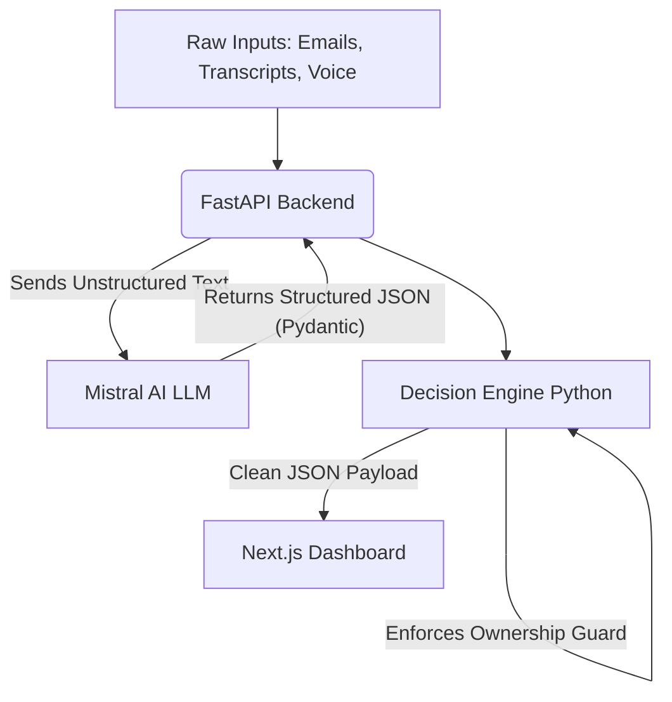

# System Architecture

The ExecPilot Agent uses a decoupled, traceable architecture to ensure reliability and trust.

## Core Principles
1. **LLMs are for Extraction, not Logic:** The LLM (Mistral AI) is exclusively used to read messy text (emails, transcripts) and extract raw actions and evidence quotes. It is expressly forbidden from doing date math or assigning ownership.
2. **Deterministic Resolution:** A Python decision engine (`decision_engine.py`) takes the extracted data and deterministically calculates the state (e.g. `overdue` vs `pending`) using strict `datetime` math.
3. **Ownership Guard:** If the LLM extraction does not produce a clear owner from the text, the Python engine intercepts the task and flags it as `unowned` and `critical`.

## Process Flow

## Time-Machine Capabilities & Caching
> [!WARNING]
> **Current Implementation Flaws:**
> 1. **Time Machine Breakage:** The decision engine supports an `as_of` timestamp. However, the `cache_commitments.json` relies on evidence objects that lack valid ISO timestamps, meaning the time-filtering engine defaults everything to Monday, breaking the simulation.
> 2. **Mistral Extraction Crash:** Missing the `MISTRAL_API_KEY` causes a hard crash in the backend layer instead of gracefully falling back. Furthermore, when Mistral is successfully called, it often outputs natural language dates (e.g., "morning") that break the deterministic Python `datetime.fromisoformat` parser.
