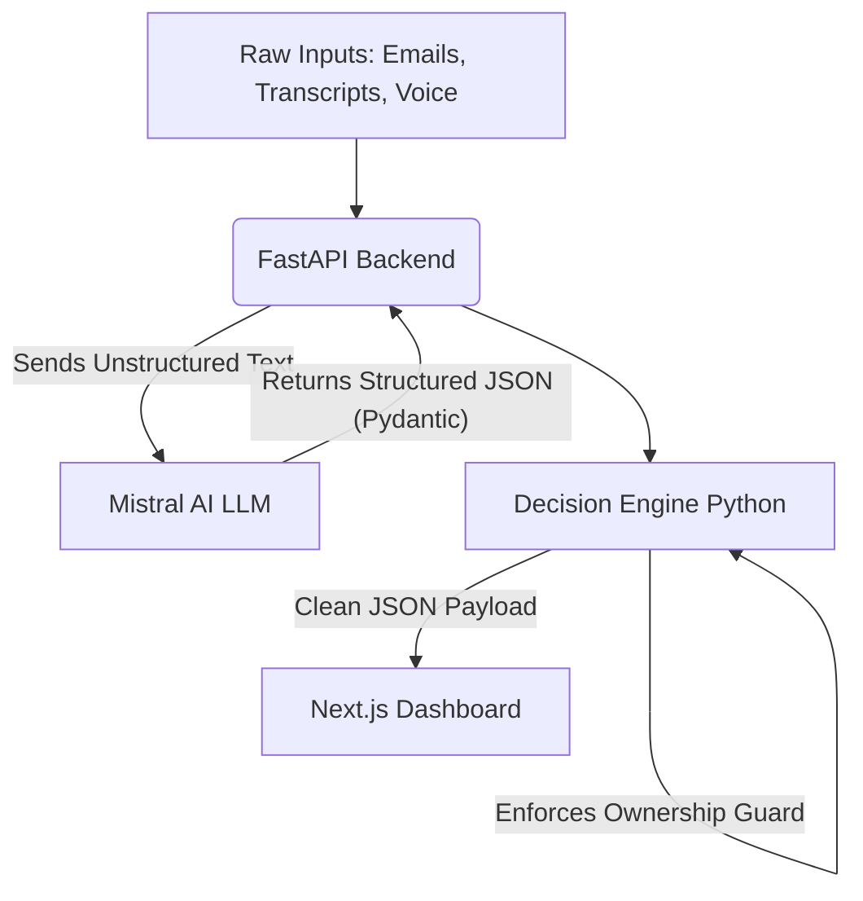

# System Architecture

The ExecPilot Agent uses a decoupled, traceable architecture to ensure reliability and trust.

## Core Principles
1. **LLMs are for Extraction, not Logic:** The LLM (Mistral AI) is exclusively used to read messy text (emails, transcripts) and extract raw actions and evidence quotes. It is expressly forbidden from doing date math or assigning ownership.
2. **Deterministic Resolution:** A Python decision engine (`decision_engine.py`) takes the extracted data and deterministically calculates the state (e.g. `overdue` vs `pending`) using strict `datetime` math.
3. **Ownership Guard:** If the LLM extraction does not produce a clear owner from the text, the Python engine intercepts the task and flags it as `unowned` and `critical`.

## Process Flow

## Time-Machine Capabilities
The decision engine supports an `as_of` timestamp. This allows the backend to filter out any "future" evidence relative to the simulation clock. This is critical for demonstrating how the agent dynamically updates states as time passes (e.g. Wednesday morning vs Wednesday evening).
